# Production-Grade-DevSecOps

A production-oriented DevSecOps reference architecture on AWS. This repository provisions cloud infrastructure with Terraform, configures Jenkins with Ansible, runs CI pipelines with SonarQube and Kaniko, and deploys workloads to Amazon EKS via ArgoCD GitOps with automated image updates from ECR.

Application source code lives in a separate repository ([demo_project](https://github.com/Nayra000/demo_project.git)). This repo owns **infrastructure, CI configuration, GitOps manifests, and Kubernetes workloads**.

## Tech Stack

| Layer                    | Technologies                                                  |
| ------------------------ | ------------------------------------------------------------- |
| Cloud                    | AWS (VPC, EKS 1.32, EC2, ECR, Secrets Manager, ALB, IAM/IRSA) |
| Infrastructure as Code   | Terraform >= 1.5.0                                            |
| Configuration Management | Ansible, Jenkins Configuration as Code (JCasC)                |
| CI                       | Jenkins, Kaniko, SonarQube                                    |
| CD / GitOps              | ArgoCD, ArgoCD Image Updater, Kustomize                       |
| Runtime                  | Node.js backend, MongoDB 7.0                                  |
| Secrets                  | External Secrets Operator, AWS Secrets Manager                |

## Architecture Overview

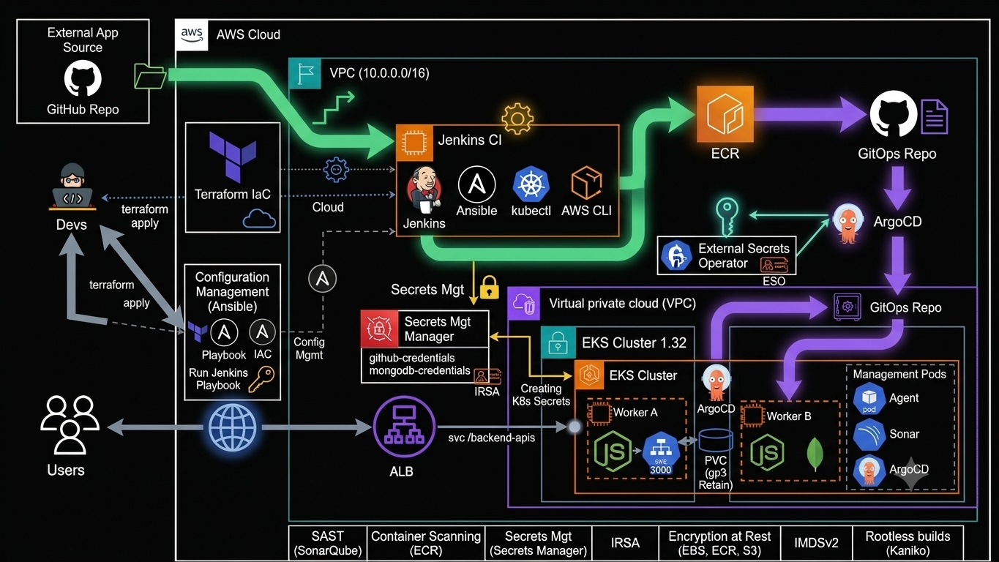

### Infrastructure Schema

The diagram below mirrors a classic AWS DevSecOps layout: developers provision infrastructure with Terraform, Jenkins orchestrates CI from an EC2 server, workloads run on EKS in private subnets, and users reach the application through an ALB.

Infrastructure Schema

Mermaid source (editable diagram)

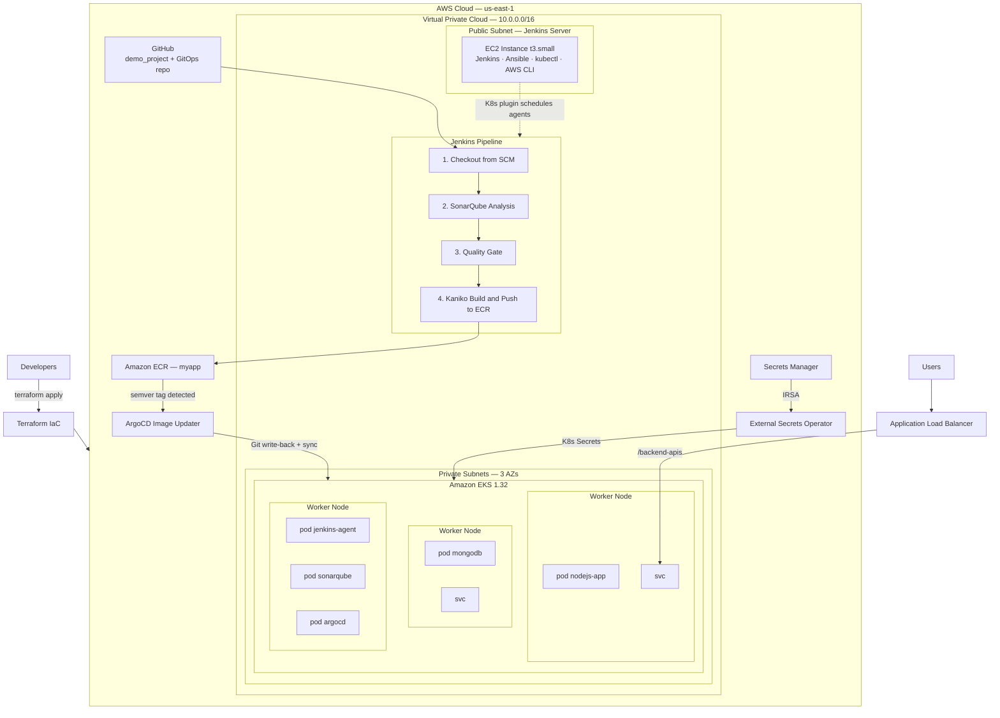

### CI/CD Flow

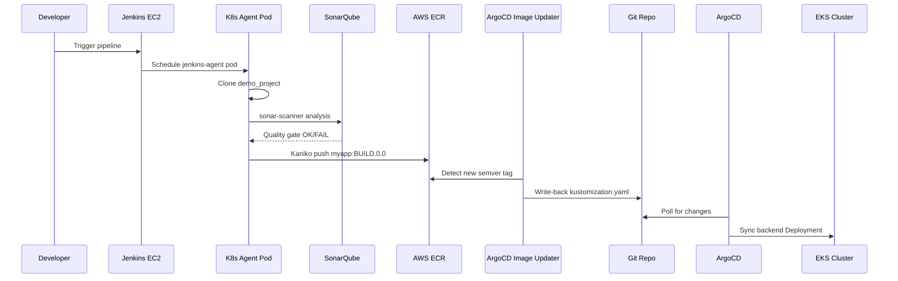

## Repository Structure

```
Production-Grade-DevSecOps/
├── terraform/                  # AWS infrastructure (IaC)
│   ├── main.tf                 # Module orchestration
│   ├── variables.tf            # Input variables
│   ├── outputs.tf              # Key outputs
│   ├── providers.tf            # AWS, Kubernetes, Helm providers
│   ├── backend.tf              # S3 remote state
│   └── modules/
│       ├── vpc/                # VPC, subnets, NAT, IGW
│       ├── ec2/                # Jenkins EC2 + IAM/SG
│       ├── eks/                # EKS cluster, node groups, IRSA, RBAC
│       ├── addons/             # EKS add-ons + ALB controller
│       ├── argocd/             # ArgoCD Helm release
│       ├── ecr/                # ECR repo + IRSA roles
│       ├── secretmanager/      # Secrets Manager + IRSA
│       └── sonarqube/          # (Unused — commented out in main.tf)
│
├── ansible/                    # Jenkins server configuration
│   ├── ansible.cfg
│   ├── jenkins.yaml            # Playbook entry point
│   └── roles/jenkins/
│       ├── tasks/              # install, plugins, config, tools
│       ├── templates/          # JCasC (Kubernetes cloud config)
│       └── tasks/files/plugins.txt
│
├── pipeline/
│   └── jenkinsfile             # CI pipeline (SonarQube + Kaniko → ECR)
│
├── argocd/                     # GitOps application definitions
│   ├── bootstrap-app.yaml      # App-of-apps root
│   └── applications/
│       ├── backend.yaml
│       ├── database.yaml
│       ├── secrets.yaml
│       ├── external-secret-operator.yaml
│       ├── sonarqube.yaml
│       └── argocd-image-updater.yaml
│
└── k8s-manifests/              # Kubernetes workloads (GitOps source)
    ├── backend/                # Node.js app deployment
    ├── database/               # MongoDB StatefulSet
    └── secrets/                # External Secrets + ClusterSecretStore
```

| Path                               | Purpose                                                            |
| ---------------------------------- | ------------------------------------------------------------------ |
| `[terraform/](terraform/)`         | AWS IaC — VPC, EKS, Jenkins EC2, ECR, Secrets Manager, ArgoCD Helm |
| `[ansible/](ansible/)`             | Jenkins bootstrap — Java 21, plugins, JCasC, kubectl, AWS CLI      |
| `[pipeline/](pipeline/)`           | Jenkins CI pipeline — SonarQube + Kaniko                           |
| `[argocd/](argocd/)`               | GitOps app-of-apps definitions                                     |
| `[k8s-manifests/](k8s-manifests/)` | Workloads synced by ArgoCD (backend, DB, secrets)                  |

## Components

### Terraform

`[terraform/main.tf](terraform/main.tf)` orchestrates all AWS infrastructure through a module dependency chain:

```
vpc → ec2 → eks → addons → argocd
                    ↓
              ecr, secretmanager (parallel, depend on EKS OIDC)
```

#### Modules

| Module              | Path                                                                   | Description                                                                                                                                                                                                                                                         |
| ------------------- | ---------------------------------------------------------------------- | ------------------------------------------------------------------------------------------------------------------------------------------------------------------------------------------------------------------------------------------------------------------- |
| **VPC**             | `[terraform/modules/vpc/](terraform/modules/vpc/)`                     | VPC `10.0.0.0/16`, 3 availability zones, public and private subnets, single NAT gateway, internet gateway. Subnets tagged for EKS and ALB controller discovery.                                                                                                     |
| **EC2**             | `[terraform/modules/ec2/](terraform/modules/ec2/)`                     | Jenkins server in a public subnet (`t3.small`, Amazon Linux 2023, 30 GB encrypted gp3 root volume). IAM role grants EKS cluster access.                                                                                                                             |
| **EKS**             | `[terraform/modules/eks/](terraform/modules/eks/)`                     | Kubernetes 1.32 cluster with managed node groups, encrypted gp3 EBS, IMDSv2 required. IRSA roles for ALB Controller, EBS CSI, and Cluster Autoscaler. RBAC for Jenkins. aws-auth mappings for `DevOpsRole` (system:masters) and `jenkins-ec2-role` (jenkins-group). |
| **Addons**          | `[terraform/modules/addons/](terraform/modules/addons/)`               | EKS add-ons (VPC CNI, CoreDNS, kube-proxy, EBS CSI), AWS Load Balancer Controller via Helm, default `gp3` StorageClass.                                                                                                                                             |
| **ArgoCD**          | `[terraform/modules/argocd/](terraform/modules/argocd/)`               | ArgoCD Helm chart installation with custom values.                                                                                                                                                                                                                  |
| **ECR**             | `[terraform/modules/ecr/](terraform/modules/ecr/)`                     | `myapp` repository with scan-on-push, AES256 encryption, lifecycle policy (keep last 10 images). IRSA roles for Jenkins (push) and ArgoCD Image Updater (read).                                                                                                     |
| **Secrets Manager** | `[terraform/modules/secretmanager/](terraform/modules/secretmanager/)` | Secrets for MongoDB credentials (`mongodb-credentials`) and GitHub credentials (`github-credentials`). IRSA role for External Secrets Operator.                                                                                                                     |

#### Remote State

Terraform state is stored remotely in S3 (`[terraform/backend.tf](terraform/backend.tf)`):

- Bucket: `my-terraform-state-105489233077`
- Key: `eks/terraform.tfstate`
- Region: `us-east-1`
- Encryption: enabled

#### Required Variables

Create `terraform/terraform.tfvars` (gitignored) with values for:

| Variable       | Description                            |
| -------------- | -------------------------------------- |
| `environment`  | Environment name (e.g. `production`)   |
| `project_name` | Project name used in resource naming   |
| `cluster_name` | EKS cluster name                       |
| `key_name`     | EC2 key pair for SSH access to Jenkins |
| `node_groups`  | EKS managed node group configurations  |

See `[terraform/variables.tf](terraform/variables.tf)` for defaults and full schema.

#### Outputs

| Output                   | Description                                |
| ------------------------ | ------------------------------------------ |
| `jenkins_public_ip`      | Public IP of the Jenkins EC2 instance      |
| `myapp_secrets_role_arn` | IAM role ARN for External Secrets Operator |

### Ansible

`[ansible/jenkins.yaml](ansible/jenkins.yaml)` applies the `jenkins` role to the EC2 host defined in `ansible/inventory` (gitignored).

The role performs:

1. **Install** — Java 21, Jenkins LTS
2. **Plugins** — Installs plugins listed in `[ansible/roles/jenkins/tasks/files/plugins.txt](ansible/roles/jenkins/tasks/files/plugins.txt)` (Kubernetes, SonarQube, Configuration as Code, etc.)
3. **Configuration** — JCasC from `[ansible/roles/jenkins/templates/jenkins.yaml.j2](ansible/roles/jenkins/templates/jenkins.yaml.j2)`
4. **Tools** — AWS CLI, kubectl, EKS kubeconfig for cluster access

The JCasC template configures a Kubernetes cloud in the `jenkins` namespace with a pod template (`jenkins-agent`) containing three containers:

| Container       | Image                                  | Purpose                   |
| --------------- | -------------------------------------- | ------------------------- |
| `jnlp`          | `jenkins/inbound-agent`                | Jenkins agent connection  |
| `kaniko`        | `gcr.io/kaniko-project/executor:debug` | Rootless container builds |
| `sonar-scanner` | `sonarsource/sonar-scanner-cli:latest` | Static code analysis      |

### Jenkins Pipeline

`[pipeline/jenkinsfile](pipeline/jenkinsfile)` defines the CI pipeline. It runs on Kubernetes agents (label `jenkins-agent`) in the `jenkins` namespace.

| Stage                        | Action                                                                              |
| ---------------------------- | ----------------------------------------------------------------------------------- |
| **Clone Repo**               | Clones [demo_project](https://github.com/Nayra000/demo_project.git) (`main` branch) |
| **SonarQube Analysis**       | Runs `sonar-scanner` in the `sonar-scanner` container against project key `myapp`   |
| **Quality Gate**             | Waits up to 5 minutes; fails the pipeline if SonarQube gate status is not `OK`      |
| **Build & Push with Kaniko** | Builds from the cloned repo's `Dockerfile`, pushes to ECR                           |

**Image tagging:** `<BUILD_NUMBER>.0.0` (semver-compatible for ArgoCD Image Updater)

**ECR destination:** `054892330771.dkr.ecr.us-east-1.amazonaws.com/myapp:<tag>`

### ArgoCD GitOps

ArgoCD is installed by Terraform and bootstrapped with the app-of-apps pattern.

#### Bootstrap

`[argocd/bootstrap-app.yaml](argocd/bootstrap-app.yaml)` points at `argocd/applications/` in this repo with automated sync (prune + self-heal). Apply it once to register all child applications:

```bash
kubectl apply -f argocd/bootstrap-app.yaml
```

#### Application Inventory

| Application            | Source                   | Namespace        | Sync Wave | Notes                                     |
| ---------------------- | ------------------------ | ---------------- | --------- | ----------------------------------------- |
| `database-app`         | `k8s-manifests/database` | default          | 1         | MongoDB StatefulSet                       |
| `backend-app`          | `k8s-manifests/backend`  | default          | 2         | Image Updater annotations for auto-deploy |
| `secrets-app`          | `k8s-manifests/secrets`  | default          | —         | ExternalSecret CRs                        |
| `external-secrets`     | Helm chart 2.6.0         | external-secrets | —         | IRSA to Secrets Manager                   |
| `sonarqube`            | Helm chart 10.0.0        | sonarqube        | —         | SAST server with ALB ingress              |
| `argocd-image-updater` | Helm chart 0.9.6         | argocd           | —         | Semver auto-update from ECR               |

All applications use **automated sync** with **prune** and **selfHeal**.

#### Image Update Flow

`[argocd/applications/backend.yaml](argocd/applications/backend.yaml)` carries ArgoCD Image Updater annotations:

- Watches ECR repo `054892330771.dkr.ecr.us-east-1.amazonaws.com/myapp`
- Update strategy: semver
- Write-back method: Git (via `argocd/github-secret`)
- Write-back target: `kustomization.yaml` in `k8s-manifests/backend/`

When Jenkins pushes a new semver tag, Image Updater commits the updated image tag to Git; ArgoCD syncs the new Deployment automatically.

### Kubernetes Manifests

#### Backend (`[k8s-manifests/backend/](k8s-manifests/backend/)`)

| Resource      | Details                                                                      |
| ------------- | ---------------------------------------------------------------------------- |
| Deployment    | 2 replicas, Node.js app on port 3000                                         |
| ConfigMap     | Application configuration (e.g. `PORT`)                                      |
| Service       | ClusterIP exposing port 3000                                                 |
| Ingress       | Shared ALB (`platform-alb`), path `/backend-apis`, health check at `/health` |
| Kustomization | Image tag management for ArgoCD Image Updater write-back                     |

Environment variables are sourced from Kubernetes Secrets (via External Secrets) and ConfigMaps — no credentials in Git.

#### Database (`[k8s-manifests/database/](k8s-manifests/database/)`)

| Resource         | Details                                |
| ---------------- | -------------------------------------- |
| StatefulSet      | MongoDB 7.0, single replica            |
| Headless Service | `mongodb-headless` for stable DNS      |
| StorageClass     | `ebs-gp3` with `Retain` reclaim policy |

MongoDB root credentials are injected from `mongodb-root-secret`, synced from AWS Secrets Manager.

#### Secrets (`[k8s-manifests/secrets/](k8s-manifests/secrets/)`)

| Resource                 | Purpose                                                                              |
| ------------------------ | ------------------------------------------------------------------------------------ |
| ClusterSecretStore       | Connects to AWS Secrets Manager in `us-east-1` via IRSA                              |
| ExternalSecret (MongoDB) | Syncs `mongodb-credentials` → `mongodb-root-secret`                                  |
| ExternalSecret (Backend) | Syncs MongoDB connection URI → `nodejs-app-secret`                                   |
| ExternalSecret (GitHub)  | Syncs `github-credentials` → `argocd/github-secret` for Image Updater Git write-back |

## DevSecOps Security Features

| Practice                 | Implementation                                                                                                                            |
| ------------------------ | ----------------------------------------------------------------------------------------------------------------------------------------- |
| **SAST**                 | SonarQube analysis with quality gate — failing builds are blocked in CI                                                                   |
| **Container scanning**   | ECR scan-on-push enabled on the `myapp` repository                                                                                        |
| **Secrets management**   | External Secrets Operator syncs from AWS Secrets Manager; no secrets committed to Git                                                     |
| **IRSA**                 | Least-privilege IAM roles bound to Kubernetes service accounts (Jenkins, ArgoCD Image Updater, External Secrets, ALB Controller, EBS CSI) |
| **Encryption at rest**   | EBS volumes (EKS nodes, Jenkins EC2, MongoDB PVCs), ECR AES256, Terraform state (S3 encrypt)                                              |
| **IMDSv2**               | Required on EKS node launch template (`http_tokens = required`)                                                                           |
| **Rootless builds**      | Kaniko builds images without Docker socket access                                                                                         |
| **RBAC**                 | Scoped Jenkins Kubernetes permissions (pods, exec, logs, secrets get)                                                                     |
| **Network segmentation** | Security groups for VPC, EKS, and Jenkins EC2                                                                                             |

### Production Hardening Notes

The following items are commented out or use permissive defaults and should be tightened for production:

- EKS control plane logging (CloudWatch)
- EKS secrets encryption with KMS
- Cluster Autoscaler (Helm release commented out)
- VPC endpoints for S3 and ECR
- EKS public API endpoint CIDR restriction (defaults to `0.0.0.0/0`)
- Jenkins and EKS security group ingress rules
- ArgoCD `server.insecure: true`
- Jenkins default admin credentials in JCasC template (change after first login)

## IAM / IRSA Roles

| Service Account                | Namespace        | IAM Role                    | Permissions                                                        |
| ------------------------------ | ---------------- | --------------------------- | ------------------------------------------------------------------ |
| `jenkins`                      | jenkins          | `jenkins-irsa-role`         | ECR push/pull for `myapp` repo                                     |
| `argocd-image-updater-sa`      | argocd           | `argocd-image-updater-role` | ECR read/describe for `myapp` repo                                 |
| `external-secrets-sa`          | external-secrets | `myapp-secrets-role`        | Secrets Manager read (`mongodb-credentials`, `github-credentials`) |
| `aws-load-balancer-controller` | kube-system      | ALB Controller role         | ELB, EC2, WAF management                                           |
| `ebs-csi-controller-sa`        | kube-system      | EBS CSI role                | EBS volume attach/detach/create                                    |

**EC2 IAM roles (aws-auth mapped):**

| Role               | EKS Access                    |
| ------------------ | ----------------------------- |
| `DevOpsRole`       | `system:masters`              |
| `jenkins-ec2-role` | `jenkins-group` (scoped RBAC) |

## External Dependencies

| Dependency       | Reference                                                    |
| ---------------- | ------------------------------------------------------------ |
| Application repo | `https://github.com/Nayra000/demo_project.git`               |
| GitOps repo      | `https://github.com/Nayra000/Production-Grade-DevSecOps.git` |
| AWS Account      | `054892330771`                                               |
| AWS Region       | `us-east-1`                                                  |

## Prerequisites

- AWS account with permissions to create VPC, EKS, EC2, ECR, IAM, Secrets Manager, and S3 resources
- Terraform >= 1.5.0
- Ansible
- AWS CLI and kubectl configured locally
- EC2 key pair in the target region
- S3 bucket for Terraform remote state (update `[terraform/backend.tf](terraform/backend.tf)` if using a different bucket)
- Secrets populated in AWS Secrets Manager after Terraform apply:
  - `mongodb-credentials` — MongoDB root username/password
  - `github-credentials` — GitHub token for ArgoCD Image Updater write-back

## Deployment Guide

### 1. Configure Terraform

Create `terraform/terraform.tfvars` with your environment values:

```hcl
environment   = "production"
project_name  = "myapp"
cluster_name  = "myapp-production"
key_name      = "your-ec2-key-pair"
aws_region    = "us-east-1"

node_groups = {
  general = {
    instance_types = ["t3.medium"]
    min_size       = 2
    max_size       = 4
    desired_size   = 2
    disk_size      = 50
    capacity_type  = "ON_DEMAND"
    labels         = { role = "general" }
    taints         = []
  }
}
```

### 2. Provision Infrastructure

```bash
cd terraform
terraform init
terraform plan
terraform apply
```

Note the `jenkins_public_ip` output for the next step.

### 3. Populate Secrets

After Terraform creates the Secrets Manager entries, set their values:

```bash
aws secretsmanager put-secret-value \
  --secret-id mongodb-credentials \
  --secret-string '{"MONGO_INITDB_ROOT_USERNAME":"admin","MONGO_INITDB_ROOT_PASSWORD":"<password>"}'

aws secretsmanager put-secret-value \
  --secret-id github-credentials \
  --secret-string '{"username":"<github-user>","password":"<github-token>"}'
```

### 4. Configure Jenkins

Create `ansible/inventory`:

```ini
[jenkins]
<JENKINS_PUBLIC_IP> ansible_user=ec2-user ansible_ssh_private_key_file=~/.ssh/your-key.pem
```

Run the playbook:

```bash
cd ansible
ansible-playbook -i inventory jenkins.yaml
```

Access Jenkins at `http://<JENKINS_PUBLIC_IP>:8080`.

### 5. Bootstrap ArgoCD Applications

Configure kubectl for the EKS cluster, then apply the bootstrap app:

```bash
aws eks update-kubeconfig --name myapp-production --region us-east-1
kubectl apply -f argocd/bootstrap-app.yaml
```

Verify all applications sync successfully:

```bash
kubectl get applications -n argocd
```

### 6. Create Jenkins Pipeline

In the Jenkins UI:

1. Create a new **Pipeline** job
2. Under **Pipeline**, select **Pipeline script from SCM**
3. SCM: Git, repository URL: `https://github.com/Nayra000/Production-Grade-DevSecOps.git`
4. Script path: `pipeline/jenkinsfile`

Configure the SonarQube server (`Manage Jenkins → Configure System → SonarQube servers`) with name `sonarqube` pointing to the SonarQube service in the cluster.

### 7. Verify End-to-End

1. Trigger the Jenkins pipeline manually
2. Confirm SonarQube analysis and quality gate pass
3. Verify the image appears in ECR: `aws ecr describe-images --repository-name myapp`
4. Confirm ArgoCD Image Updater writes the new tag to `k8s-manifests/backend/kustomization.yaml`
5. Confirm ArgoCD syncs the backend Deployment
6. Access the application via the ALB at `http://<alb-dns>/backend-apis`

# Project Evidence

The following screenshots demonstrate the successful deployment and operation of the platform.

## Infrastructure

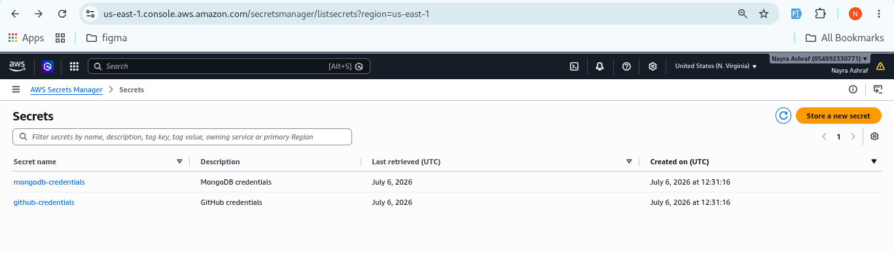
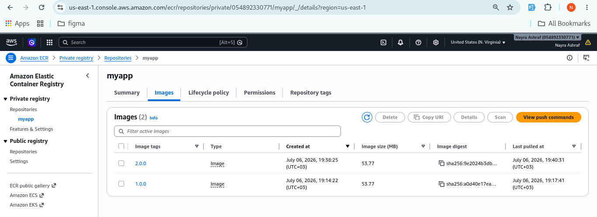
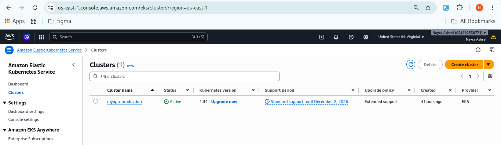
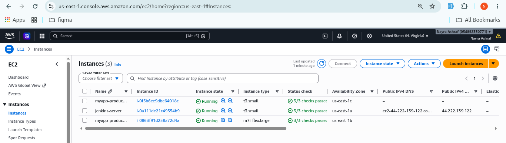
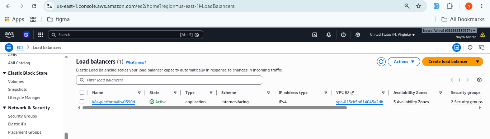

---

## Jenkins CI Pipeline and SonarQube

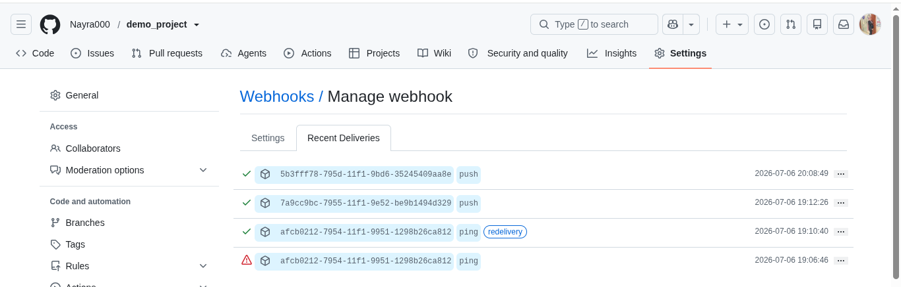
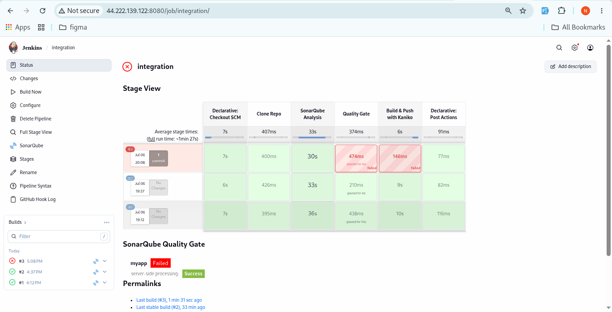
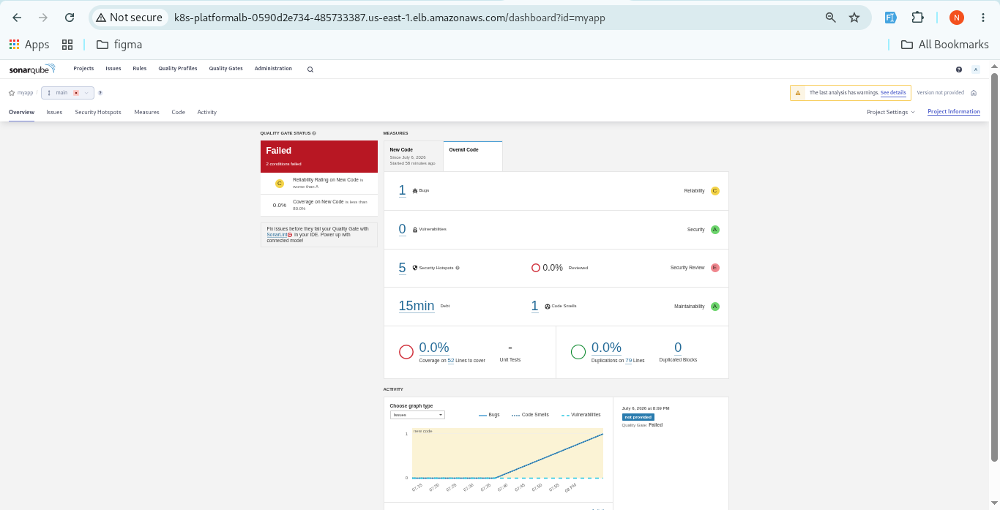
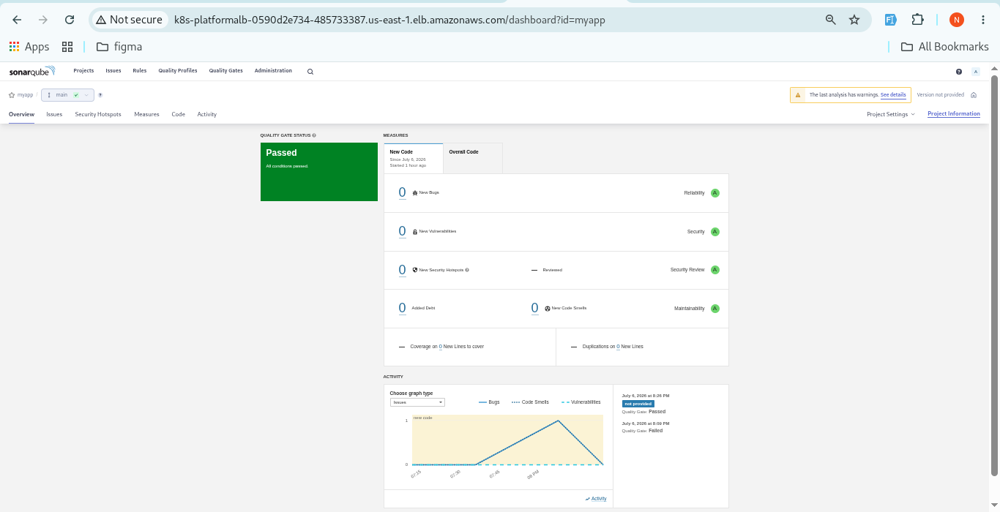

## ArgoCD GitOps

Application synchronized successfully.

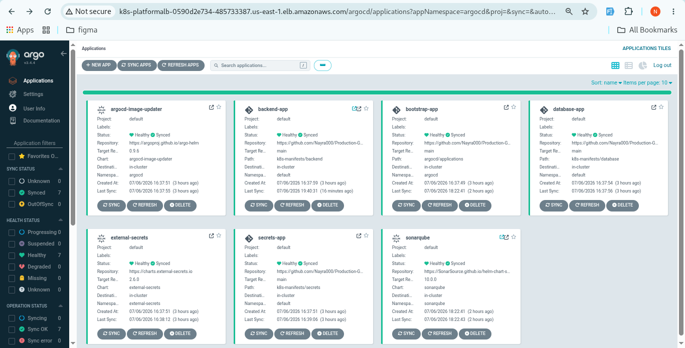

Automatic image update detected by ArgoCD Image Updater.

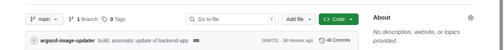

---

## Kubernetes

Running workloads inside Amazon EKS.

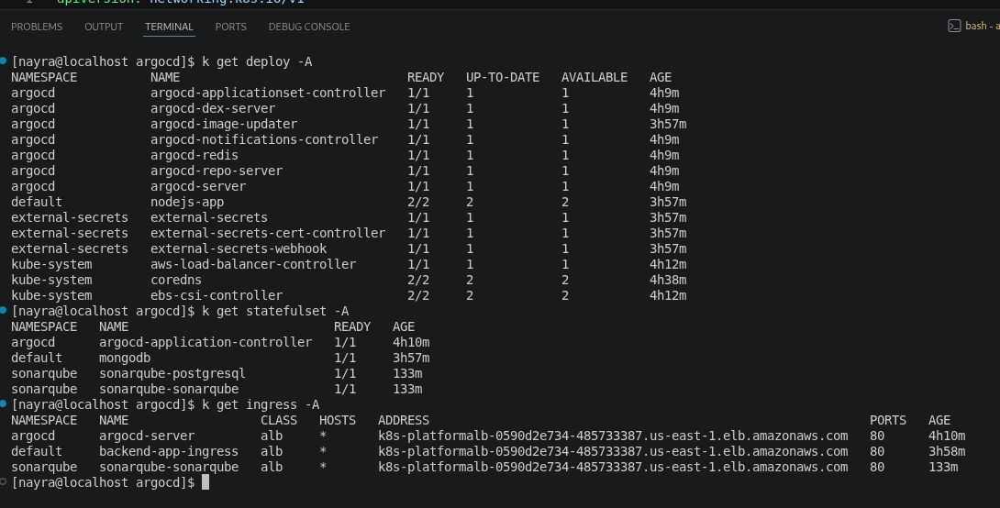

---

## Application

Backend application deployed successfully through the shared ALB.

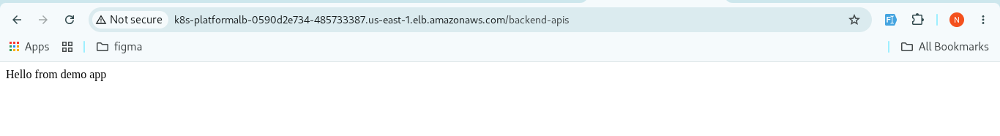

## License

This project is provided as a reference architecture for learning and demonstration purposes.
